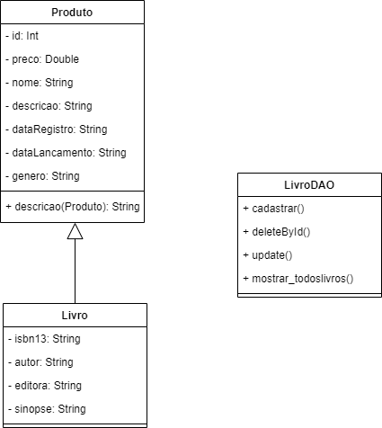
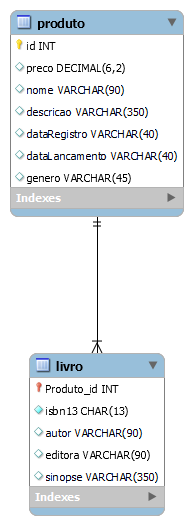

# Descrição do projeto

O projeto **Livraria Livrados** consiste em um CRUD em Java para gerenciamento de livros em uma livraria. Ele foi feito para uma atividade em trio para a cadeira de **Análise e Projeto de Sistemas** do curso de Análise e Desenvolvimento de Sistemas na Faculdade SENAC/PE. 

# Requisitos e funcionalidades

**CRUD usando orientação a objetos** - criação, leitura, atualização e deleção dos dados a partir da implementação de classes e objetos em Java, bem como de seus métodos Getters e Setters;

Persistência de dados, para a qual escolhemos o uso de **Banco de dados entidade-relacionamento**;

Além do uso de login e senha, os quais poderiam ser fixos a fim de simplificar o trabalho, para isso criamos o login `test` e a senha é `123`.

## Modelagem de classes e dados

Imagem do UML
Banco de dados - Modelo Relacional

# Tecnologias usadas

Java;

NetBeans;

MySQL;

Diagrams.net; &

GitHub.

# Colaboradores

[Gilmar Adrian](https://www.linkedin.com/in/brazadrian/);

[Karolayne Silva;](https://www.linkedin.com/in/karolayne-silvas/)

[Erika Santos](https://www.linkedin.com/in/erika-santos-84566224a/).